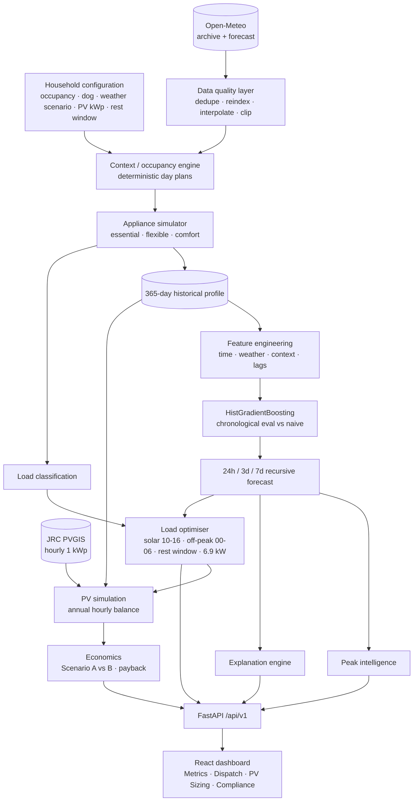
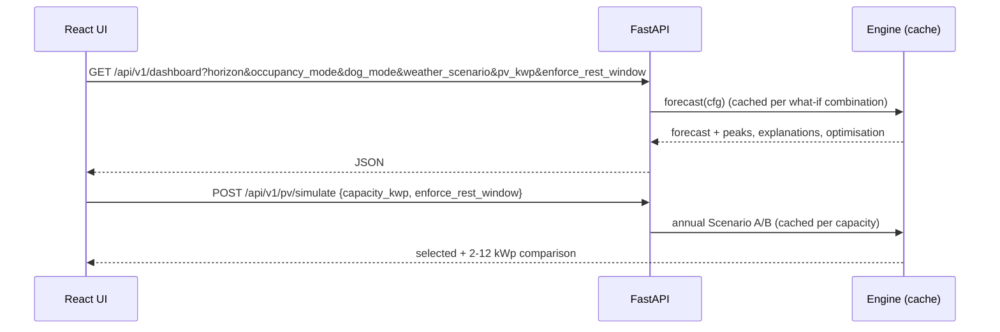

# Architecture

## Request flow

## Lifecycle
1. **Startup:** a background thread builds the engine.
   - Weather is fetched (disk-cached) and the history is simulated.
   - The model is trained and evaluated, and PVGIS is loaded (about 10–30 s).
   - All 60 what-if forecasts and all PV capacities are then pre-computed (about 45 s).
2. **Hourly rebuild:** when the Lisbon hour changes, the engine rebuilds in the background. The previous state keeps serving in the meantime, so the forecast always starts at the current hour.
3. **Failure handling:** each external call falls back to the last cached response, then to the deterministic climatology. The UI shows the active source.

## Deployment
- **Single container:** the root `Dockerfile` builds the UI with Node and serves `frontend/dist` from FastAPI on `$PORT`.
- **Dev:** `docker-compose.yml` runs the backend on :8000 plus the Vite dev server on :5173 (the `/api` proxy uses `VITE_API_TARGET`).
- **Static frontend (e.g. Vercel):** build with `VITE_API_BASE=https://<backend-host>`. CORS is open.
